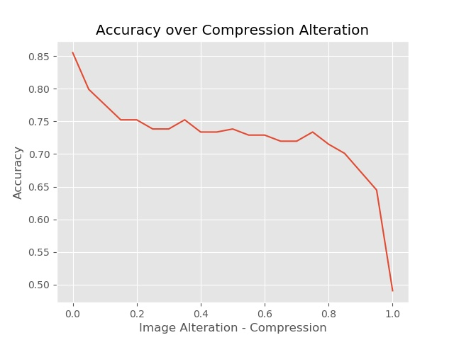

# roby: neural network ROBusteness analYzer

roby (ROBustness analYzer) is a Python tool to perform robustness evaluation of neural network classifiers. Given a trained model, a classified dataset and the list of classes, alterations are applied and the robustness is computed based on the accuracy threshold defined.

## How to use roby

### Requirements

roby has been designed to be more flexible as possible. However, there are some requirements needed for the use of the tool:

1. Alterations must be expressible as input modification between a _minumum_ and a _maximum_ threshold.

2. The model to be tested must be in the _Keras_ format.

3. Only ANNs used for _classification_ are supported by roby.

4. Input data must be representable using `np.ndarray`.

### Installation

roby can be installed using the pip package-management system with
```python
pip install roby
```

## Tutorials and application scenarios

### Tutorial 1: Images classifier - Local execution

In this Tutorial 1, the robustness of a CNN images classifier is analyzed. The execution of all the code is performed locally.

* Create a python file

* Import roby
```python
from roby import *
```

* Load your **model** and locate your **images**. The model can be stored in a `.model` or in a `.h5` file and must be in the _Keras_ format.

  ```python
  model = load_model('modelFile.model')
  ```
  Get the images in the test data-set. These can be loaded as a list of paths
  ```python
  file_list = sorted(list(paths.list_images('images')))
  ```
  or as a list of `np.ndarray` as commonly happens when working with already available datasets (eg., in pickle files).

  For each input image we must give the correct label, in order to make possible the evaluation of the results of the CNN when alterations are applied. This can be done in two different ways:
    * Defining a `labeler` function, assigning to each image the correct label
    * Creating a list containing the corresponding label for each input image.
  In this tutorial the first option is used, but more details are reported in the "How to extend roby" section of this documentation.

  Set the classes available for classification.
  ```python
  classes = set_classes('model\\Classes.csv')
```

4. define your environment

load the environment
```python
environment = EnvironmentRTest(model, file_list, classes, labeler_f=labeler)
```


5. check the current accuracy of your model

Get the standard behavior of the net
```python
accuracy = classification(environment)
```


6. check the robustness against a desired alteration

create the alteration_type as a GaussianNoise with variance 200
```python
alteration_type: Alteration = GaussianNoise(0, 1, 200)
```

Set the accuracy threshold
```python
accuracy_treshold = 0.8
```

robustness analysis, with 20 points
```python
results = robustness_test(environment, alteration_type, 20,
                              accuracy_treshold)
display_robustness_results(results)
```



### Tutorial 2: Images classifier - Cloud execution


### Tutorial 3: Images classifier with customized alteration


### Tutorial 4: Sounds classifier


## How to extend roby

* **Loading**:  users can create a testing environment either by giving the path of all the input data
```python
path_list : List[str] = [...]
env = EnvironmentRTest.EnvironmentRTest(model, input_dataset, classes,
                                   label_list=label_list)
```
or by a list of data already in the `np.ndarray` format
```python
path_list : List[np.ndarray] = [...]
env = EnvironmentRTest.EnvironmentRTest(model, input_dataset, classes,
                                  label_list=label_list)
```
If paths are given, for classification purposes, the User shall specify the way to be used to convert the data in the `np.ndarray` format by declaring a
`reader` function:
```python
def reader(file_name: str)
  ...
  return data: np.ndarray
```

* **Labeling**: real labels for input data can be given either with a list of all the labels or by giving a `labeler` function. In the former case, the list `label_list` must be of the same size as the input dataset
```python
env = EnvironmentRTest.EnvironmentRTest(model, input_dataset, classes,
                                   label_list=label_list)
```
while in the latter case the user must define a function receiving a data (in `np.ndarray` format) and returning a string representing the real label
```python
def labeler(image: np.ndarray):
    ...
    return real_label: str
```
and pass this function when defining the environment
```python
env = EnvironmentRTest.EnvironmentRTest(model, file_list, classes,
                                   labeler_f=labeler)
```

* **Alterations**: roby includes the abstract class
```python
Alterations.Alteration
```
that can be extended to create customized alterations. When extending the abstract class, the user must implement the following functions:
  * `name()` returning the name of the alteration.
  * `apply_alteration_data(data, alteration_level)` receiving the input data in the format of `np.ndarray` and returning the data of the same format with the alteration applied
  * `apply_alteration(file_name, alteration_level)` receiving the path of the input data and returning the data with the applied alteration.

* **Pre/Post-processing**: Users can adapt test input data to the ones used for NN training. During the declaration of the test environment users can specify a pre-processing and/or a post-processing function. The former must follow the pattern
```python
def pre_processing(image: np.ndarray):
    ...
    return image: np.ndarray
```
and it is applied to each input data before its recognition by the NN. The latter allows the user to scale the probabilities given as output by the NN. It must follow this pattern
```python
def post_processing(probabilities: List[float]):
    ...
    return new_probabilities:  List[float]
```
The declaration of these two functions is not mandatory. If the user has defined one of them, they can be specified in the declaration of the test environment
```python
env = EnvironmentRTest.EnvironmentRTest(model, file_list, classes,
                                   preprocess_f=pre_processing,
                                   postprocess_f=post_processing,
                                   labeler_f=labeler)
```

### APIs documentation

A full documentation of the roby's APIs can be found at
<https://fmselab.github.io/roby/apis/>

## Examples of use

* Breast cancer images dataset
  <https://github.com/fmselab/roby/tree/main/code/roby_Use/breast-cancer>

* MNIST dataset
  <https://github.com/fmselab/roby/tree/main/code/roby_Use/MNIST>

* German Traffic Signs dataset
  <https://github.com/fmselab/roby/tree/main/code/roby_Use/trafficsigns-imagefailures>

* Numbers recognition from speech
  <https://github.com/fmselab/roby/tree/main/code/roby_Use/speech_recognition>
